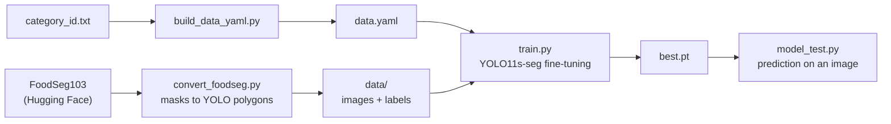

# Load-Cell Integrated Food Tracker

A work-in-progress dietary monitoring project that combines computer vision with weight sensing. The repository currently contains the computer-vision component: a YOLO11s instance-segmentation training pipeline for food items, built on the FoodSeg103 dataset.

> **Status: in progress.** Only the segmentation model pipeline is implemented in this repository. Load-cell integration, weight estimation, nutrition processing and any backend or agent layer are not yet present. See [Current Status](#current-status).

## Overview

Dietary tracking from a photograph is limited by the fact that an image shows what food is present but not how much of it there is. This project is intended to address that by pairing image-based food segmentation with a load cell (weight sensor), so that each detected food item can later be associated with a measured quantity.

The vision side is the part implemented here. The pipeline converts the FoodSeg103 semantic-segmentation dataset into the polygon label format that Ultralytics YOLO expects, trains a YOLO11s-seg model on it, and provides scripts for inspecting labels and running prediction on a photograph. The sensing, estimation and nutrition stages are future work.

## Key Features

Implemented in this repository:

- **Dataset conversion.** `convert_foodseg.py` downloads FoodSeg103 from Hugging Face and converts each per-pixel class mask into normalized polygon labels, using OpenCV contour extraction and discarding contours smaller than 50 px² of area.
- **Class configuration.** `build_data_yaml.py` generates `data.yaml` from the FoodSeg103 category list in `category_id.txt` (103 food categories).
- **Model training.** `train.py` fine-tunes the pretrained `yolo11s-seg.pt` checkpoint for instance segmentation with a documented configuration: 120 epochs with early stopping (patience 25), 640 px images, batch size 6, `retina_masks` enabled, class-loss weight 1.2, dropout 0.1, mosaic and mixup augmentation, and a small rotation range.
- **Trained weights.** `weights/yolo11s_food_best.pt` is a trained checkpoint. Its stored metadata identifies a YOLO11s segmentation model with 104 class entries (the 103 FoodSeg103 categories plus a background entry in `data.yaml`) and training arguments that match `train.py`.
- **Inspection utilities.** `visualize_seg.py` draws polygon labels over an image, `test.py` uses the Ultralytics annotation visualizer, `inspect_foodseg.py` prints the dataset structure, and `importtorch.py` checks for a CUDA GPU.
- **Inference script.** `model_test.py` runs prediction on a single image with a 0.25 confidence threshold and saves the annotated result.

## Architecture

The implemented pipeline is an offline training workflow:



No runtime application, service or hardware interface exists in the repository. The `.gitignore` mentions transferring weights to a Raspberry Pi, but no deployment code is included.

## Technology Stack

| Area | Technologies |
| --- | --- |
| Language | Python |
| AI/ML | Ultralytics YOLO (YOLO11s-seg), PyTorch (CUDA GPU training) |
| Computer vision | OpenCV, NumPy |
| Dataset | FoodSeg103 (`EduardoPacheco/FoodSeg103`) through the Hugging Face `datasets` library |
| Configuration | YAML (`data.yaml`) |

## Project Structure

```
weights/
  yolo11s_food_best.pt        Trained YOLO11s-seg food segmentation checkpoint
yolo_pipeline/
  convert_foodseg.py          FoodSeg103 masks to YOLO polygon labels
  build_data_yaml.py          category_id.txt to data.yaml
  category_id.txt             FoodSeg103 category list
  data.yaml                   Dataset and class configuration for training
  train.py                    Training configuration and entry point
  model_test.py               Prediction on a single image
  visualize_seg.py            Draw polygon labels over an image
  test.py, inspect_foodseg.py, importtorch.py   Small inspection and environment checks
  yolo11s-seg.pt              Pretrained base checkpoint used by train.py
  yolo11n-seg.pt, yolo26n.pt  Additional base checkpoints (not used by any script)
```

Datasets (`yolo_pipeline/data/`), training runs (`runs/`) and image outputs are excluded by `.gitignore`.

## How It Works

1. **Convert the dataset.** For each FoodSeg103 image, the script reads the class mask, extracts the external contour of each class region, normalizes the coordinates to the image size, and writes one polygon per line to a YOLO label file next to the saved JPEG, split into `train` and `val`.
2. **Configure classes.** `data.yaml` lists the dataset path, the `train` and `val` image folders and the class names.
3. **Train.** `train.py` loads `yolo11s-seg.pt` and trains on the dataset on GPU device 0, caching images to disk.
4. **Predict.** `model_test.py` loads trained weights, runs prediction on an image and saves the image with masks and labels drawn.

## Setup / Installation

The repository does not include a requirements file. The scripts import `ultralytics`, `torch`, `datasets`, `opencv-python` (`cv2`), `numpy` and `pyyaml`. Training is configured for a CUDA GPU (`device=0`), which `importtorch.py` can confirm.

Before running the scripts, review the following, which are visible in the code:

- The scripts use relative paths and are written to be run from `yolo_pipeline/`. `convert_foodseg.py` writes to `../data` and `build_data_yaml.py` writes `path: ../yolo_pipeline/data`, whereas the committed `data.yaml` contains `path: ../data`. Confirm that the dataset path resolves correctly for the working directory in use.
- `model_test.py` loads weights from `runs/segment/food_seg_11s_v2/weights/best.pt` and a local Windows image path. Both should be edited, for example to use `weights/yolo11s_food_best.pt` and a local image.
- `visualize_seg.py` and `test.py` reference fixed example image paths under `data/`.

## Testing

No automated tests are included. No evaluation results (for example mAP, precision or recall) are stored in the repository, so none are reported here.

## Current Status

**In progress. Partially implemented.**

| Component | State |
| --- | --- |
| Dataset conversion to YOLO polygon format | Implemented |
| YOLO11s-seg training configuration | Implemented |
| Trained segmentation weights | Included, without recorded evaluation metrics |
| Prediction on a single image | Implemented as a script |
| Load-cell and sensor integration | Not present in this repository |
| Weight estimation | Not present |
| Nutrition lookup or calculation | Not present |
| Backend, data storage or AI-agent functionality | Not present |
| Raspberry Pi deployment | Not present |

Known inconsistencies in the current pipeline:

- `convert_foodseg.py` writes every polygon with class `0` (a single generic food class), while `data.yaml` and the included weights use the 103 FoodSeg103 categories. The conversion script as committed does not reproduce the labels the included weights were trained on.
- `data.yaml` contains a `-1: background` entry produced by the one-based to zero-based offset in `build_data_yaml.py`.

These should be reconciled before the dataset is regenerated or the model is retrained.

## Future Improvements

- Align the conversion script and `data.yaml` so that a fresh run reproduces the training setup, and record the evaluation metrics of the trained model.
- Add a requirements file and make the scripts independent of the working directory.
- Integrate a load cell and its reader, and associate measured weight with each segmented item.
- Add a weight-estimation step and a nutrition mapping from food category and weight.
- Package inference as a runtime component suitable for the target device.
